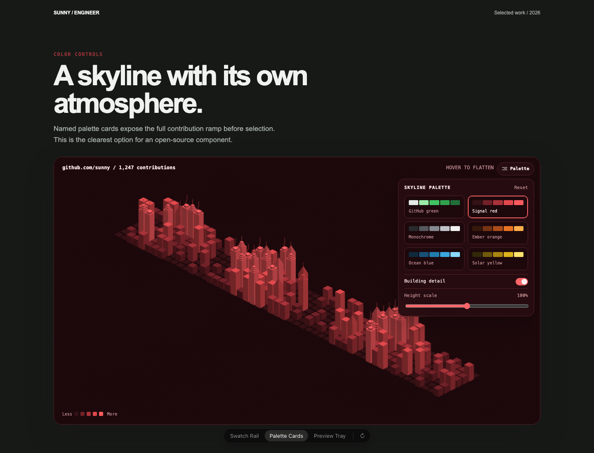

# GitHub Contribution Skyline

An accessible, themeable GitHub contribution graph rendered as a three-dimensional city skyline. Every day is a building, exact contribution counts drive height, and the skyline can transition back to the familiar flat calendar.



The package contains an original Canvas 2D renderer, a React wrapper, and an optional custom element. It does not fetch data or require a GitHub token in the browser.

## Features

- Exact contribution counts and UTC-safe dates
- Event-driven rendering that stops when transitions settle
- Hover, touch, and keyboard view switching
- Semantic contribution table and live keyboard announcements
- Six built-in semantic palettes and custom palette support
- Art Deco crowns, pyramids, mechanical penthouses, antennas, and conventional spires
- Loading, empty, invalid-data, Canvas-unavailable, and renderer-error states
- Responsive sizing, capped device pixel ratio, reduced motion, and offscreen pausing
- React and Web Component entry points

## Install

```sh
npm install github-contribution-skyline
```

React and ReactDOM are peer dependencies.

## React usage

```tsx
import { GitHubSkyline } from 'github-contribution-skyline/react';
import type { ContributionDay } from 'github-contribution-skyline';

const days: ContributionDay[] = [
  { date: '2026-09-24', count: 4 },
  { date: '2026-09-25', count: 11 },
  { date: '2026-09-26', count: 2 },
];

export function Activity() {
  return (
    <GitHubSkyline
      contributions={days}
      username="sunny"
      palette="red"
      buildingDetail
      heightScale={1}
      onDaySelect={(day) => console.log(day)}
    />
  );
}
```

`contributions` is required. All other props are reactive. `initialView` is read when the renderer is created; use the imperative handle for later view changes.

```tsx
const skyline = useRef<GitHubSkylineHandle>(null);

<GitHubSkyline ref={skyline} contributions={days} />
<button onClick={() => skyline.current?.setView('graph')}>Show graph</button>
```

## Data format

```ts
type ContributionDay = {
  date: string;
  count: number;
  level?: 0 | 1 | 2 | 3 | 4;
};
```

Dates use `YYYY-MM-DD` and are interpreted in UTC. Missing dates inside the displayed period are filled with zeroes. Duplicate dates are merged by summing counts, and the last explicit level wins. If levels are omitted, the package derives relative quartiles from the supplied exact counts. Input can span a partial year or up to 54 displayed calendar weeks.

## GitHub GraphQL adapter

GitHub's `contributionCalendar` includes exact daily counts, relative levels, dates, weeks, and a total. Fetch it on a server because a GitHub token must never be embedded in browser code.

```ts
// Server-only module
import { fromGitHubContributionCalendar } from 'github-contribution-skyline';

const query = `
  query Contributions($login: String!) {
    user(login: $login) {
      contributionsCollection {
        contributionCalendar {
          totalContributions
          weeks {
            contributionDays {
              date
              contributionCount
              contributionLevel
            }
          }
        }
      }
    }
  }
`;

const response = await fetch('https://api.github.com/graphql', {
  method: 'POST',
  headers: {
    Authorization: `Bearer ${process.env.GITHUB_TOKEN}`,
    'Content-Type': 'application/json',
  },
  body: JSON.stringify({ query, variables: { login: 'sunny' } }),
});

const payload = await response.json();
const calendar = payload.data.user.contributionsCollection.contributionCalendar;
const contributions = fromGitHubContributionCalendar(calendar);
```

Pass the serialized `contributions` result to the client component. Private contribution visibility follows the permissions and profile settings of the server-side GitHub token.

## Props

| Prop | Type | Default | Purpose |
| --- | --- | --- | --- |
| `contributions` | `ContributionDay[]` | required | Exact daily contribution data |
| `username` | `string` | empty | Account label above the skyline |
| `totalContributions` | `number` | computed | Optional server-provided total |
| `palette` | palette name or custom palette | `green` | Complete semantic color theme |
| `heightScale` | `number` | `1` | Height multiplier, clamped to `0.4-2` |
| `buildingDetail` | `boolean` | `true` | Enables sparse architectural roof details on selected high-rises |
| `flattenMode` | `auto`, `hover`, `press`, `always`, `never` | `auto` | Input behavior for changing views |
| `initialView` | `skyline`, `graph` | `skyline` | Initial renderer view |
| `showControls` | `boolean` | `true` | Displays the Details panel |
| `showLegend` | `boolean` | `true` | Displays the contribution ramp |
| `showLabels` | `boolean` | `true` | Displays calendar labels in graph view |
| `locale` | `string` | `en-US` | Date and number locale |
| `weekStartsOn` | `0`, `1` | `0` | Sunday or Monday alignment |
| `ariaLabel` | `string` | descriptive default | Accessible region name |
| `maxDevicePixelRatio` | `number` | `2` | Canvas-resolution cap, clamped to `1-4` |
| `status` | `ready`, `loading`, `error` | `ready` | External loading state |
| `errorMessage` | `string` | safe default | User-facing loading error |
| `reducedMotion` | `boolean` | system preference | Explicit motion override |
| `onDayHover` | callback | none | Receives hovered day or `null` |
| `onDaySelect` | callback | none | Receives a selected day |
| `onViewChange` | callback | none | Receives settled view state |
| `onPaletteChange` | callback | none | Supports controlled palettes |
| `onHeightScaleChange` | callback | none | Supports controlled height |
| `onBuildingDetailChange` | callback | none | Supports controlled detail |

## Palettes

Built-in names are `green`, `red`, `mono`, `orange`, `blue`, and `yellow`. A custom palette defines semantic surfaces instead of applying a hue filter:

```ts
const violet = {
  name: 'violet', label: 'Studio violet',
  surface: '#160d20', elevated: '#21132e', ink: '#f8efff', muted: '#bca4cd',
  border: '#513467', grid: '#2d183d', focus: '#c78aff',
  levels: ['#2d183d', '#593078', '#7d43a8', '#a864dc', '#d49aff'],
  texture: 'none',
} as const;
```

Advanced layout variables can be set on the host:

```css
.portfolio-skyline {
  --gcs-radius: 12px;
  --gcs-min-height: 520px;
  --gcs-shadow: 0 18px 50px rgb(0 0 0 / 0.16);
  --gcs-font-family: system-ui, sans-serif;
}
```

Internal DOM structure is not a theming API.

## Custom element

```ts
import { defineGitHubSkyline } from 'github-contribution-skyline/element';

defineGitHubSkyline();
const skyline = document.querySelector('github-contribution-skyline');
skyline.contributions = days;
skyline.setAttribute('palette', 'blue');
```

The element emits `day-hover`, `day-select`, `view-change`, and `palette-change` custom events.

## Accessibility

The Canvas is decorative to assistive technology. Exact provided contribution days are exposed in a semantic table. The focusable component surface supports Enter and Space to switch views, arrow keys to navigate days in graph view, and Escape to close settings. Day selection is announced through a polite live region. Reduced-motion preferences replace animated transitions with immediate state changes.

## Performance

The renderer draws only after data, size, palette, settings, or view changes. Its animation frame loop stops when a transition settles. Rendering pauses when the document is hidden or the component leaves the viewport. Cells are normalized and depth-sorted before drawing, and device pixel ratio is capped by default.

## SSR and Next.js

The React wrapper renders a stable host during SSR and creates the renderer after hydration. In the Next.js App Router, render it from a client component:

```tsx
'use client';
export { GitHubSkyline } from 'github-contribution-skyline/react';
```

Fetch GitHub data in a server component, route handler, or build step, then pass serializable contribution days to the client component.

## Browser support

The package targets current stable Chrome, Edge, Firefox, and Safari releases with Canvas 2D, custom elements, ResizeObserver, and Shadow DOM. `color-mix()` and backdrop filtering have solid-color fallbacks. The React wrapper does not require custom-element registration.

## Troubleshooting

- Empty state: provide at least one valid contribution day.
- Invalid state: counts must be non-negative integers and the period cannot exceed 378 days.
- Missing private contributions: verify server token permissions and the GitHub profile setting.
- Blurry Canvas: raise `maxDevicePixelRatio` carefully; higher values use more memory.
- Next.js hydration: fetch server-side and render the wrapper from a client boundary.

## Development

```sh
npm install
npm run dev
npm run lint
npm run typecheck
npm test
npm run test:e2e
npm run build
npm pack --dry-run
```

The original visual studies remain in [`prototypes/`](prototypes/).

## Contributing and security

See [CONTRIBUTING.md](CONTRIBUTING.md), [CODE_OF_CONDUCT.md](CODE_OF_CONDUCT.md), and [SECURITY.md](SECURITY.md).

## Attribution and independence

The interaction concept was inspired by GitHub contribution visualizations, including Reactiive's GitHub Terrain demo. This package is an independent Canvas 2D implementation. It does not contain or redistribute Reactiive source code, shaders, constants, or utilities.

## License

MIT. See [LICENSE](LICENSE).
